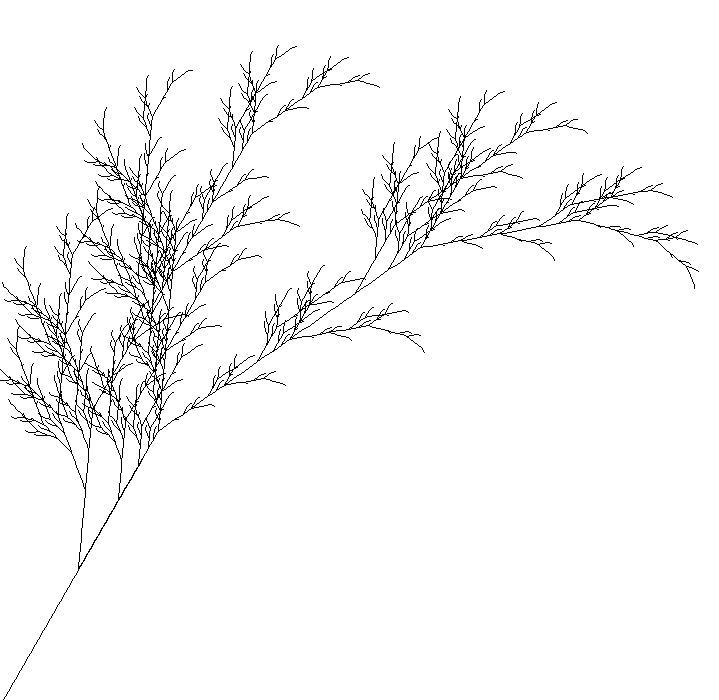

# Фракталы

## Кривая дракона

Кривая дракона - общее название для некоторых фрактальных кривых,
которые могут быть аппроксимированы рекурсивными методами,
такими как системы Линденмайера или L-системы. 

Кривая дракона, вероятно, чаще всего считается формой, которая создается
путем многократного складывания полосы бумаги пополам, хотя есть и
другие кривые, которые называются кривыми дракона, которые создаются
по-другому. 

Wiki: https://en.wikipedia.org/wiki/Dragon_curve
Wiki: https://en.wikipedia.org/wiki/L-system

Пример кривой дракона с раскраской:

## Фрактальное растение

С помощью L-систем легко описать формы подобные фракталам, например, как это растение.

Wiki: https://en.wikipedia.org/wiki/L-system#Example_7:_Fractal_plant

Пример растения для степени рекурсии 6:

